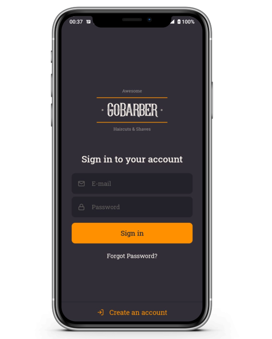

<h1 align="center">GoBarber - Mobile</h1>

  <a href="#-requirements">Requirements</a>&nbsp;&nbsp;&nbsp;|&nbsp;&nbsp;&nbsp;
  <a href="#-technologies">Technologies</a>&nbsp;&nbsp;&nbsp;|&nbsp;&nbsp;&nbsp;
  <a href="#-project">Project</a>&nbsp;&nbsp;&nbsp;|&nbsp;&nbsp;&nbsp;
  <a href="#-how-to-execute">How to execute</a>&nbsp;&nbsp;&nbsp;

## 📋 Requirements
To run this app it's understood that you have already configured and installed Android Studio, JDK and SDK. For more information on how to configure your environment, read the documentation.
[React Native Docs](https://reactnative.dev/docs/environment-setup)

## ✨ Technologies

This project is being developed with the following technologies:

- [React Native CLI](https://github.com/facebook/react-native)
- [Typescript](https://github.com/microsoft/TypeScript)
- [Styled Components](https://github.com/styled-components/styled-components)
- [Axios](https://github.com/axios/axios)
- [Unform](https://github.com/unform/unform)
- [Eslint](https://github.com/eslint/eslint)
- [Prettier](https://github.com/prettier/prettier)

## 💻 Project

GoBarber is an application that connects barbers with customers allowing them to schedule an appointment through a beautiful and intuitive layout

## 🚀 How to execute
The first step to enjoy GoBarber is to initiate the server. The instructions to run it can be found in this repository: [GoBarber API](https://github.com/gcrodrigues/gobarber-api)

After running the server, you must:
- Install the dependencies with `yarn`
- Run `yarn start` to start Metro Bundler
- If you are using android device/emulator, run `yarn android`
- But if your device/emulator is an IOS, run `yarn ios`
